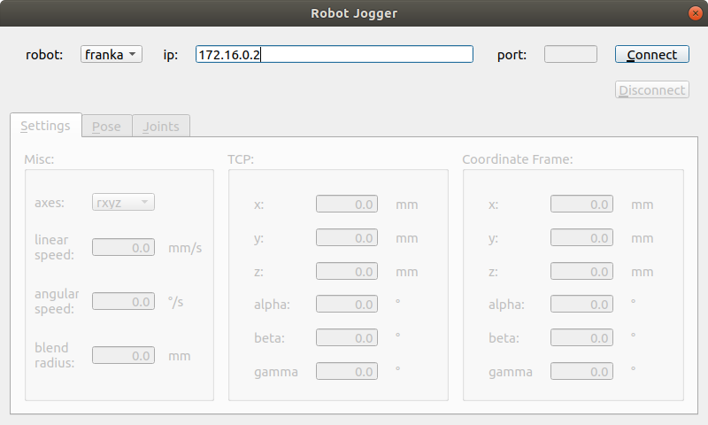
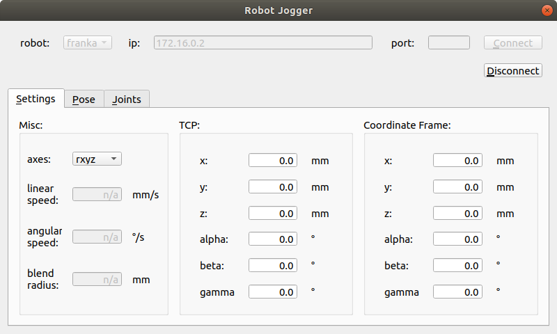
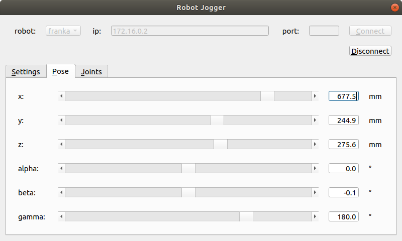
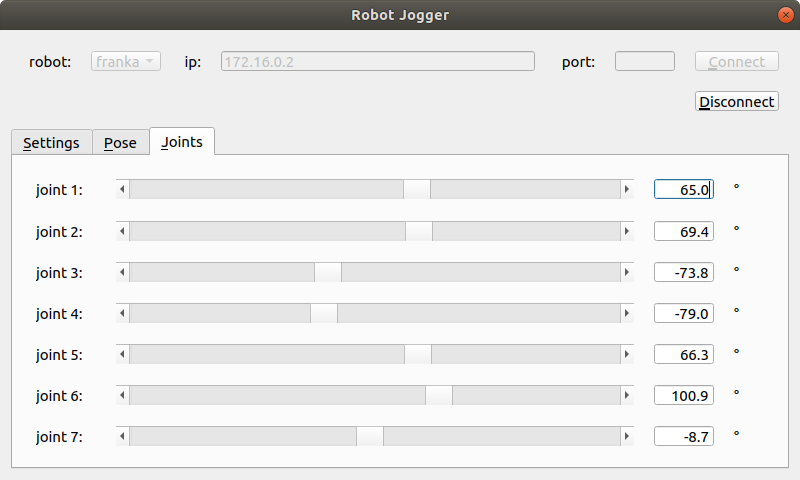

# Common Robot Interface
>A Python library for controlling various robot arms using a common interface.

The Common Robot Interface (CRI) library currently supports the following robot arms:

- ABB Robotics IRB 120
- Universal Robots UR3/5/10 - using the [Real-Time Data Exchange (RTDE)](https://www.universal-robots.com/articles/ur/interface-communication/real-time-data-exchange-rtde-guide/) protocol
- Franka Panda - using the [Pyfranka library](https://github.com/jlloyd237/pyfranka)

A GUI-based robot jogger tool is also included with the library.  This tool can be used to move the robot into different configurations, and is particularly useful for setting up experiments.

## Installation

To install the package on Windows or Linux, clone the repository and run the setup script from the repository root directory:

```sh
pip install -e .
```
The robot jogger tool requires the PyQt5 GUI framework, and this can be installed using the Python package installer:
```sh
pip install pyqt5
```
In a [Conda](https://docs.conda.io/en/latest/) environment, the CRI library and robot jogger tool can be installed using:
```sh
conda create -n cri python=3.7
conda activate cri
pip install -e .
pip install pyqt5
```
If you want to use this library to control a Franka Panda robot arm, you'll also need to download and install the [Pyfranka library](https://github.com/jlloyd237/pyfranka) as well as its various dependencies.

## Uploading and running the server

For ABB and UR robots, the framework uses a client-server approach for communicating with the back-end robot controller.  Before running the server on the controller, the code must be uploaded using an FTP client or some other means.

For an ABB robot, upload the `/cri/abb/abb_server.mod` RAPID file to the controller, install it as the main program module under a new program and then run the program using the FlexPendant or RobotStudio application.

For a UR robot, upload the `/cri/ur/rtde_server.script`URScript file to the controller, install it as the main script under a new program and then run the program using the Teach Pendant.  A helpful guide for installing the URScript file on UR robot controllers can be found [here](https://github.com/s-nam/UniversalRobots/blob/main/CRI_installation_guide/README.md).

For a Franka Panda robot, a server script is not required as the communication with the controller takes place via `libfranka` and the Franka Control Interface (FCI).

## Examples

Some examples that demonstrate how to use the library are included in the `/examples` directory.  These can be modified to suit different system configurations and requirements (e.g., IP address, work space, work frame, etc.)

After installing and running the server (only needed for ABB and UR robots), the examples can be run from the `/examples` directory using one of the following:

- For an ABB robot (see [video](https://youtu.be/3VoqrG-k_hM) for expected behaviour):
	```sh
	python abb_robot_test.py
	```

- For a UR robot (see [video](https://youtu.be/RAudiK4Rv6Q) for expected behaviour):
	```sh
	python rtde_robot_test.py
	```
- For a Franka robot (see [video](https://youtu.be/_hQp4J_aapQ) for expected behaviour) 
	```sh
	python pyfranka_robot_test.py
	```

## Robot jogger

The robot jogger tool is included in the `/tools/robot_jogger` directory.  After installing and running the server (only needed for ABB and UR robots - see above), the tool can be run from this directory using:
```sh
python robot_jogger.py
```
To use the jogger, select the robot type from the dropdown menu on the left, enter the IP address and port (for an ABB robot) of the robot, and press the `Connect` button:



After establishing a connection with the robot, some configuration information will  be displayed on the `Settings` tabbed pane:



This configuration information can be changed by editing the relevant fields.

To view or change the current (Cartesian) pose of the end-effector, select the `Pose` tabbed pane:



Clicking on the small arrows at either end of the slider bars produces an increase/decrease of 1mm for the position attributes and 1 degree for the rotation attributes.  Clicking within the slider bars produces an increase/decrease of 10 mm or 10 degrees.

To view or change the current joint angles of the robot, select the `Joints` tabbed pane:



Clicking on the small arrows at either end of the slider bars produces an increase/decrease of 1 degree for the joint angles.  Clicking within the slider bars produces an increase/decrease of 10 degrees.

To close the jogger tool, press the `Disconnect` button.

## Getting started
To communicate with a robot using synchronous (i.e., blocking) calls, you must first instantiate a `SyncRobot` object with the appropriate controller, e.g., for a Franka Panda robot:
```sh
from cri.robot import SyncRobot
from cri.controller import PyfrankaController

robot = SyncRobot(PyfrankaController(ip='172.16.0.2'))   # for Franka
``` 
You can then access various properties of the robot using, e.g.,
```sh
robot.axes = 'sxyz'   # use extrinsic-xyz Euler convention
robot.tcp = (0, 0, 75, 0, 0, 225)   # set tool centre point
robot.coord_frame = (400, 0, 300, 180, 0, 180)   # set work/task frame

joints = robot.joint_angles   # get current joint angles
pose = robot.pose   # get current pose of end effector in work/task frame

```
To perform a joint-space move, use:
```sh
robot.move_joints((0, -35, 0, -150, 0, 115, -45))   # j0 - j6 in degrees
```
To perform a Cartesian-space (i.e., task space) move, use:
```sh
robot.move_linear((50, 50, 50, 30, 30, 30))   # (x, y, z, alpha, beta, gamma)
```
All frames and poses use the Euler convention specified by `robot.axes` and are represented using a 6-tuple (x, y, z, alpha, beta, gamma), where x, y and z are in mm and alpha, beta and gamma are in degrees.  Joint angles are specified using a 6-tuple (for a 6-DOF robot) or a 7-tuple (for a 7-DOF robot), and all angles are in degrees.

Finally, shut down the robot using:
```sh
robot.close()
```
Alternatively, you can use a context manager:
```sh
with SyncRobot(PyfrankaController(ip='172.16.0.2'))) as robot:
	# do stuff with the robot ...
```
If you want to communicate with a robot using asynchronous (i.e., non-blocking) calls, you must use the `AsyncRobot` wrapper, e.g.,
```sh
from cri.robot import SyncRobot, AsyncRobot
from cri.controller import PyfrankaController

robot = AsyncRobot(SyncRobot(PyfrankaController(ip='172.16.0.2')))
```
You can then perform asynchronous joint-space and Cartesian-space moves, e.g.,
```sh
robot.async_move_linear((50, 50, 50, 30, 30, 30))   # non-blocking
print("Getting on with something else while command completes ...")
robot.async_result()   # block for result/completion
```
Note that every call to an asynchronous move command must be followed by a corresponding call to `async_result()` before any other move commands are executed on the robot.

## Meta

John Lloyd – jlloyd237@gmail.com

Distributed under the GPL v3 license. See ``LICENSE`` for more information.

[https://github.com/jloyd237/cri](https://github.com/jlloyd237/)
